# spring-batch-inf

인프런 스프링 배치 강좌 학습 및 정리 - 

1. 스프링 배치 소개
2. 스프링 배치 시작
3. 스프링 배치 도메인 이해
4. 스프링 배치 실행
5. 스프링 배치 청크 프로세스 (1)
6. 스프링 배치 청크 프로세스 (2)
7. 스프링 배치 반복 및 오류 제어
8. 스프링 배치 멀티 스레드 프로세싱  
9. 스프링 배치 이벤트 리스너
10. 스프링 배치 테스트 및 운영   
11. 실전 ! 스프링 배치


# 1. 스프링 배치 소개
1. 스프링 배치 탄생 배경
   * 자바 기반 표준 배치 기술 부재
   * 배치 처리에서 요구하는 재사용 가능한 자바 기반 배치 아키텍처 표준의 필요성이 대두
   * 스프링 배치는 SpringSource(현재는 Pivotal)와 Accenture(경영 컨설팅 기업) 의 합작품
   * Accenture - 배치 아키텍처를 구현하면서 쌓은 기술적인 경험과 노하우
   * SpringSource - 깊이 있는 기술적 기반과 스프링의 프로그래밍 모델
   * Accenture는 이전에 소유했던 배치 처리 아키텍처 프레임워크를 Spring Batch 프로젝트에 기증함
   * https://docs.spring.io/spring-batch/docs/4.3.x/reference/html/spring-batch-intro.html#spring-batch-intro

2. ### ` 배치 핵심 패턴`
   * `Read - 데이터베이스, 파일, 큐에서 다량의 데이터 조회한다.`
   * `Process - 특정 방법으로 데이터를 가공한다.`
   * `Write - 데이터를 수정된 양식으로 다시 저장한다.`


3. 배치 시나리오
   * 배치 프로세스를 주기적으로 커밋
   * 동시 다발적인 Job 의 배치 처리, 대용량 병렬 처리
   * 실패 후 수동 또는 스케줄링에 의한 재시작
   * 의존관계가 있는 step 여러 개를 순차적으로 처리
   * 조건적 Flow 구성을 통한 체계적이고 유연한 배치 모델 구성
   * 반복, 재시도, Skip 처리

* 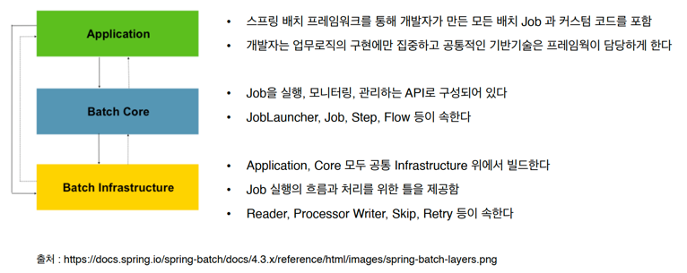

# 2. 스프링 배치 시작

## 스프링 배치 활성화

* @EnableBatchProcessing
  * 스프링 배치가 작동하기 위해 선언해야 하는 어노테이션
* 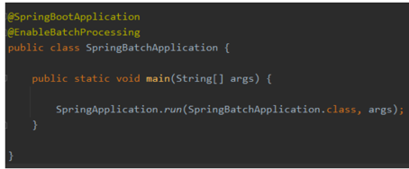
* 총 4개의 설정 클래스를 실행시키며 스프링 배치의 모든 초기화 및 실행 구성이 이루어진다

* 스프링 부트 배치의 자동 설정 클래스가 실행됨으로 빈으로 등록된 모든 Job 을 검색해서 초기화와 동시에 Job 을 수행하도록 구성됨

## `스프링 배치 초기화 설정 클래스!`
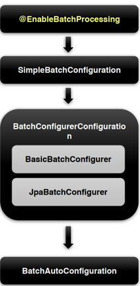

1. BatchAutoConfiguration
   * 스프링 배치가 초기화 될 때 자동으로 실행되는 설정 클래스
   * Job 을 수행하는 `JobLauncherApplicationRunner 빈을 생성`

2. SimpleBatchConfiguration
   * `JobBuilderFactory 와 StepBuilderFactory 생성`
   * 스프링 배치의 주요 구성 요소 생성 - 프록시 객체로 생성됨

3. BatchConfigurerConfiguration
   * BasicBatchConfigurer
   * SimpleBatchConfiguration 에서 생성한 프록시 객체의 실제 대상 객체를 생성하는 설정 클래스
   * 빈으로 의존성 주입 받아서 주요 객체들을 참조해서 사용할 수 있다
   * JpaBatchConfigurer
   * JPA 관련 객체를 생성하는 설정 클래스
   * 사용자 정의 BatchConfigurer 인터페이스를 구현하여 사용할 수 있음

## BatchConfiguration 
1. @Configuration 선언
   * 하나의 배치 Job 을 정의하고 빈 설정
2. JobBuilderFactory
   * Job 을 생성하는 빌더 팩토리
3. StepBuilderFactory
   * Step 을 생성하는 빌더 팩토리
4. Job
   * helloJob 이름으로 Job 생성
5. Step
   * helloStep 이름으로 Step 생성
6. tasklet
   * Step 안에서 단일 태스크로 수행되는 로직 구현
7. Job 구동 -> Step 을 실행 -> Tasklet 을 실행

### Configuration 프로세스

* 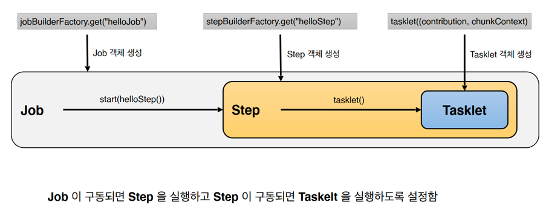
* 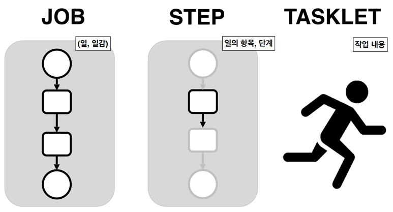

## 스프링 배치 DB스키마

1. 스프링 배치 메타 데이터
   * 스프링 배치의 실행 및 관리를 위한 목적으로 여러 도메인들(Job, Step, JobParameters..) 의 정보들을 저장, 업데이트, 조회할 수 있는 스키마 제공
   * 과거, 현재의 실행에 대한 세세한 정보, 실행에 대한 성공과 실패 여부 등을 일목요연하게 관리함으로서 배치운용에 있어 리스크 발생시 빠른 대처 가능
   * DB 와 연동할 경우 필수적으로 메타 테이블이 생성 되어야 함
2. DB 스키마 제공
   * 파일 위치 : /org/springframework/batch/core/schema-*.sql
   * DB 유형별로 제공
3. 스키마 생성 설정
   * 수동 생성 – 쿼리 복사 후 직접 실행
   * 자동 생성 - spring.batch.jdbc.initialize-schema 설정
   * ALWAYS
   * 스크립트 항상 실행
   * RDBMS 설정이 되어 있을 경우 내장 DB 보다 우선적으로 실행
   * EMBEDDED : 내장 DB일 때만 실행되며 스키마가 자동 생성됨, 기본값
   * NEVER
   * 스크립트 항상 실행 안함
   * 내장 DB 일경우 스크립트가 생성이 안되기 때문에 오류 발생
     * 이경우 우리가 만들어 줘야 한다. 
   * 운영에서 수동으로 스크립트 생성 후 설정하는 것을 권장
      * 파일 위치 : /org/springframework/batch/core/schema-*.sql 에서 복사 가능! 

* ## Job 관련 테이블
* BATCH_JOB_INSTANCE
  * Job 이 실행될 때 JobInstance 정보가 저장되며 job_name과 job_key를 키로 하여 하나의 데이터가 저장
    * 동일한 job_name 과 job_key 로 중복 저장될 수 없다

  * ```sql
    CREATE TABLE BATCH_JOB_INSTANCE (
     JOB_INSTANCE_ID BIGINT PRIMARY KEY ,   # 고유하게 식별할 수 있는 기본 키
     VERSION BIGINT,                        # 업데이트 될 때 마다 1씩 증가
     JOB_NAME VARCHAR(100) NOT NULL ,       # Job 을 구성할 때 부여하는 Job 의 이름 
     JOB_KEY VARCHAR(2500)                  # job_name과 jobParameter 를 합쳐 해싱한 값을 저장
    );
    ```
---
* BATCH_JOB_EXECUTION
  * job 의 실행정보가 저장되며 Job 생성, 시작, 종료 시간, 실행상태, 메시지 등을 관리
  * ```sql
    CREATE TABLE BATCH_JOB_EXECUTION (
     JOB_EXECUTION_ID BIGINT PRIMARY KEY ,          # JobExecution 을 고유하게 식별할 수 있는 기본 키, JOB_INSTANCE 와 일대 다 관계
     VERSION BIGINT,                                # 업데이트 될 때마다 1씩 증가
     JOB_INSTANCE_ID BIGINT NOT NULL,               # JOB_INSTANCE 의 키 저장
     CREATE_TIME TIMESTAMP NOT NULL,                # 실행(Execution)이 생성된 시점을 TimeStamp 형식으로 기록 
     START_TIME TIMESTAMP DEFAULT NULL,             # 실행(Execution)이 시작된 시점을 TimeStamp 형식으로 기록
     END_TIME TIMESTAMP DEFAULT NULL,               # 실행이 종료된 시점을 TimeStamp으로 기록 Job 실행 도중 오류가 발생해서 Job 이 중단된 경우 값이 저장되지 않을 수 있음
     STATUS VARCHAR(10),                            # 실행 상태 (BatchStatus)를 저장 (COMPLETED, FAILED, STOPPED…)
     EXIT_CODE VARCHAR(20),                         # 실행 종료코드(ExitStatus) 를 저장 (COMPLETED, FAILED…)
     EXIT_MESSAGE VARCHAR(2500),                    # Status가 실패일 경우 실패 원인 등의 내용을 저장
     LAST_UPDATED TIMESTAMP,                        # 마지막 실행(Execution) 시점을 TimeStamp 형식으로 기록
     JOB_CONFIGURATION_LOCATION VARCHAR(2500) NULL
    );
    ```

---

* BATCH_JOB_EXECUTION_PARAMS
  * Job과 함께 실행되는 JobParameter 정보를 저장
  * ```sql
    CREATE TABLE BATCH_JOB_EXECUTION_PARAMS (
     JOB_EXECUTION_ID BIGINT NOT NULL ,     # JobExecution 식별 키, JOB_EXECUTION 과는 일대다 관계
     TYPE_CD VARCHAR(6) NOT NULL ,          # STRING, LONG, DATE, DUBLE 타입정보
     KEY_NAME VARCHAR(100) NOT NULL ,       # 파라미터 키 값
     STRING_VAL VARCHAR(250) ,              # 파라미터 문자 값
     DATE_VAL DATETIME DEFAULT NULL ,       # 파라미터 날짜 값
     LONG_VAL BIGINT ,                      # 파라미터 LONG 값
     DOUBLE_VAL DOUBLE PRECISION ,          # 파라미터 DOUBLE 값
     IDENTIFYING CHAR(1) NOT NULL           # 식별 여부(TRUE, FALSE)
    );
    ``` 
---

* BATCH_JOB_EXECUTION_CONTEXT
  * Job 의 실행동안 여러가지 상태정보, 공유 데이터를 직렬화 (Json 형식) 해서 저장
  * Step 간 서로 공유 가능함
  * ```sql
    CREATE TABLE BATCH_JOB_EXECUTION_CONTEXT (
     JOB_EXECUTION_ID BIGINT PRIMARY KEY,   # JobExecution 식별 키, JOB_EXECUTION 마다 각 생성
     SHORT_CONTEXT VARCHAR(2500) NOT NULL,  # JOB 의 실행 상태정보, 공유데이터 등의 정보를 문자열로 저장 
     SERIALIZED_CONTEXT CLOB                # 직렬화(serialized)된 전체 컨텍스트 
    );
    ```
  
---
* ## Step 관련 테이블
  * BATCH_STEP_EXECUTION
    * Step 의 실행정보가 저장되며 생성, 시작, 종료 시간, 실행상태, 메시지 등을 관리
  * ```sql
    CREATE TABLE BATCH_STEP_EXECUTION (
     STEP_EXECUTION_ID BIGINT PRIMARY KEY , # Step 의 실행정보를 고유하게 식별할 수 있는 기본 키
     VERSION BIGINT NOT NULL,               # 업데이트 될 때마다 1씩 증가
     STEP_NAME VARCHAR(100) NOT NULL,       # Step 을 구성할 때 부여하는 Step 이름
     JOB_EXECUTION_ID BIGINT NOT NULL,      #  JobExecution 기본키, JobExecution 과는 일대 다 관계
     START_TIME TIMESTAMP NOT NULL ,        # 실행(Execution)이 시작된 시점을 TimeStamp 형식으로 기록
     END_TIME TIMESTAMP DEFAULT NULL,       # 실행이 종료된 시점을 TimeStamp 으로 기록하며 Job 실행 도중 오류가 발생해서 Job 이 중단된 경우 값이 저장되지 않을 수 있음
     STATUS VARCHAR(10),                    # 실행 상태 (BatchStatus)를 저장 (COMPLETED, FAILED, STOPPED…)
     COMMIT_COUNT BIGINT ,                  # 트랜잭션 당 커밋되는 수를 기록
     READ_COUNT BIGINT ,                    # 실행시점에 Read한 Item 수를 기록
     FILTER_COUNT BIGINT ,                  # 실행도중 필터링된 Item 수를 기록
     WRITE_COUNT BIGINT ,                   # 실행도중 저장되고 커밋된 Item 수를 기록
     READ_SKIP_COUNT BIGINT ,               # 실행도중 Read가 Skip 된 Item 수를 기록
     WRITE_SKIP_COUNT BIGINT ,              # 실행도중 write가 Skip된 Item 수를 기록
     PROCESS_SKIP_COUNT BIGINT ,            # 실행도중 Process가 Skip 된 Item 수를 기록
     ROLLBACK_COUNT BIGINT ,                # 실행도중 rollback이 일어난 수를 기록
     EXIT_CODE VARCHAR(20) ,                # 실행 종료코드(ExitStatus) 를 저장 (COMPLETED, FAILED…)
     EXIT_MESSAGE VARCHAR(2500) ,           # Status가 실패일 경우 실패 원인 등의 내용을 저장
     LAST_UPDATED TIMESTAMP                 # 마지막 실행(Execution) 시점을 TimeStamp 형식으로 기록
    );
    ```
---
  * BATCH_STEP_EXECUTION_CONTEXT
    * Step 의 실행동안 여러가지 상태정보, 공유 데이터를 직렬화 (Json 형식) 해서 저장
    * Step 별로 저장되며 Step 간 서로 공유할 수 없음
    * ```sql
      CREATE TABLE BATCH_STEP_EXECUTION_CONTEXT (
       STEP_EXECUTION_ID BIGINT PRIMARY KEY,    # StepExecution 식별 키, STEP_EXECUTION 마다 각 생성
       SHORT_CONTEXT VARCHAR(2500) NOT NULL,    # STEP 의 실행 상태정보, 공유데이터 등의 정보를 문자열로 저장 
       SERIALIZED_CONTEXT CLOB                  # 직렬화(serialized)된 전체 컨텍스트
      );
      ```
---

# 3. 스프링 배치 도메인 이해

## Job 

1. 기본 개념
   * 배치 계층 구조에서 가장 상위에 있는 개념으로서 하나의 배치작업 자체를 의미함
     * “API 서버의 접속 로그 데이터를 통계 서버로 옮기는 배치“ 인 Job 자체를 의미한다.
   * Job Configuration 을 통해 생성되는 객체 단위로서 배치작업을 어떻게 구성하고 실행할 것인지 전체적으로 설정하고 명세해 놓은 객체
   * 배치 Job 을 구성하기 위한 최상위 인터페이스이며 스프링 배치가 기본 구현체를 제공한다
   * 여러 Step 을 포함하고 있는 컨테이너로서 반드시 한개 이상의 Step으로 구성해야 함

2. 기본 구현체
   * SimpleJob
     * 순차적으로 Step 을 실행시키는 Job
     * 모든 Job에서 유용하게 사용할 수 있는 표준 기능을 갖고 있음
   
   * FlowJob
     * 특정한 조건과 흐름에 따라 Step 을 구성하여 실행시키는 Job
     * Flow 객체를 실행시켜서 작업을 진행함


* 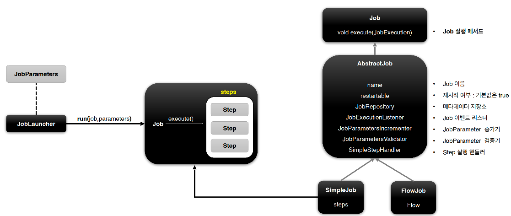
* JobLauncher가 Job을 실행시킨다. 


## JobInstance
1. 기본 개념
   * Job 이 실행될 때 생성되는 Job 의 논리적 실행 단위 객체로서 고유하게 식별 가능한 작업 실행을 나타냄
   * Job 의 설정과 구성은 동일하지만 Job 이 실행되는 시점에 처리하는 내용은 다르기 때문에 Job 의 실행을 구분해야 함
     * 예를 들어 하루에 한 번 씩 배치 Job이 실행된다면 매일 실행되는 각각의 Job 을 JobInstance 로 표현합니다.
   * JobInstance 생성 및 실행
     * 처음 시작하는 Job + JobParameter 일 경우 새로운 JobInstance 생성
     * 이전과 동일한 Job + JobParameter 으로 실행 할 경우 이미 존재하는 JobInstance 리턴 -> 재사
       * 내부적으로 JobName + jobKey (jobParametes 의 해시값) 를 가지고 JobInstance 객체를 얻음
   * Job 과는 1:M 관계


2. BATCH_JOB_INSTANCE 테이블과 매핑
   * JOB_NAME (Job) 과 JOB_KEY (JobParameter 해시값) 가 동일한 데이터는 중복해서 저장할 수 없음

* JobInstance 흐름도
* 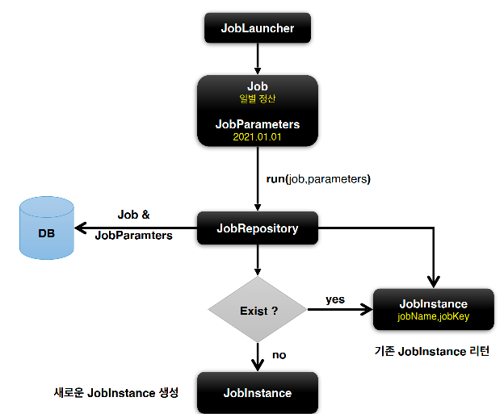
* 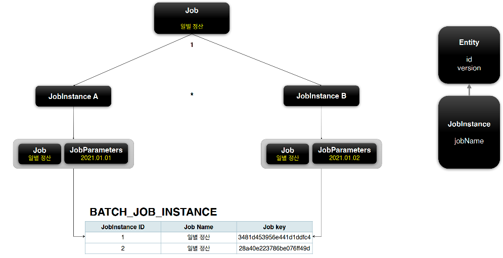


## JobParameters

1. 기본 개념
   * Job을 실행할 때 함께 포함되어 사용되는 파라미터를 가진 도메인 객체
   * 하나의 Job에 존재할 수 있는 여러개의 JobInstance를 구분하기 위한 용도
   * JobParameters와 JobInstance는 1:1 관계

2. 생성 및 바인딩
   * 어플리케이션 실행 시 주입
     * Java -jar LogBatch.jar requestDate=20210101
   * 코드로 생성
     * JobParameterBuilder, DefaultJobParametersConverter
   * SpEL 이용
     * @Value(“#{jobParameter[requestDate]}”), @JobScope, @StepScope 선언 필수

3. BATCH_JOB_EXECUTION_PARAM 테이블과 매핑
   • JOB_EXECUTION 과 1:M 의 관계

* 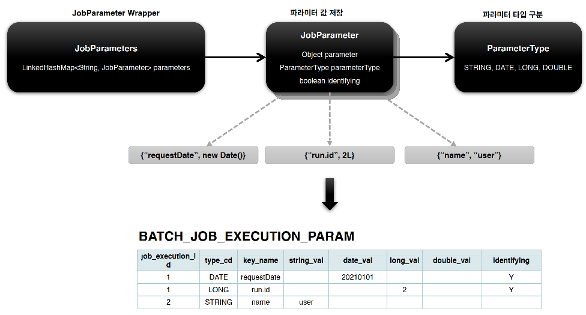

## JobExecution


1. 기본 개념
   * JobIstance 에 대한 한번의 시도를 의미하는 객체로서 Job 실행 중에 발생한 정보들을 저장하고 있는 객체
     * 시작시간, 종료시간 ,상태(시작됨,완료,실패),종료상태의 속성을 가짐
   * JobIstance 과의 관계
     * JobExecution은 'FAILED' 또는 'COMPLETED‘ 등의 Job의 실행 결과 상태를 가지고 있음
     * JobExecution 의 실행 상태 결과가 'COMPLETED’ 면 JobInstance 실행이 완료된 것으로 간주해서 재 실행이 불가함
     * JobExecution 의 실행 상태 결과가 'FAILED’ 면 JobInstance 실행이 완료되지 않은 것으로 간주해서 재실행이 가능함
       * JobParameter 가 동일한 값으로 Job 을 실행할지라도 JobInstance 를 계속 실행할 수 있음
   * JobExecution 의 실행 상태 결과가 'COMPLETED’ 될 때까지 하나의 JobInstance 내에서 여러 번의 시도가 생길 수 있음

2. BATCH_JOB_EXECUTION 테이블과 매핑
   * JobInstance 와 JobExecution 는 1:M 의 관계로서 JobInstance 에 대한 성공/실패의 내역을 가지고 있음


* 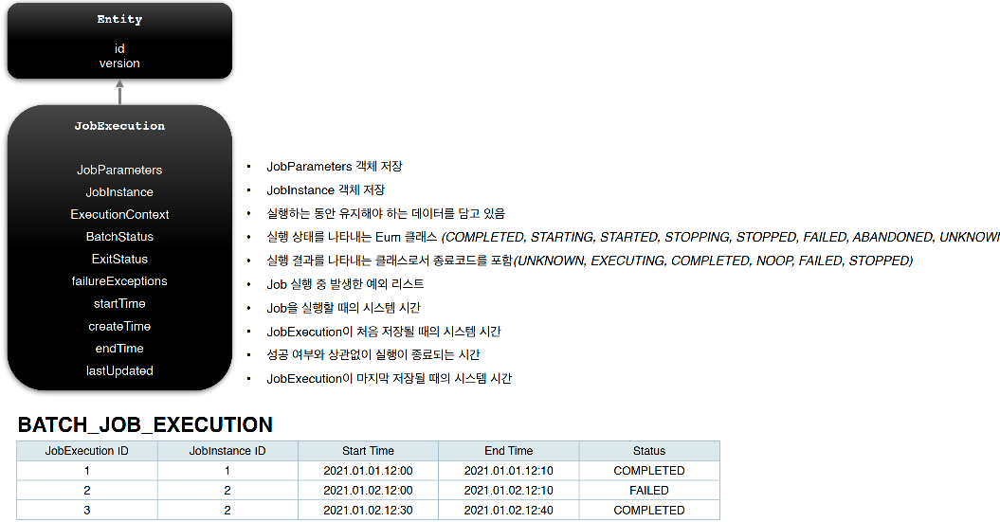
* 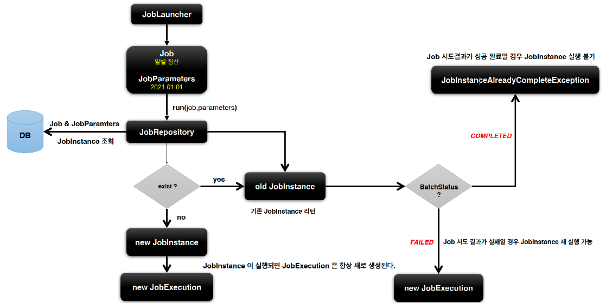
* 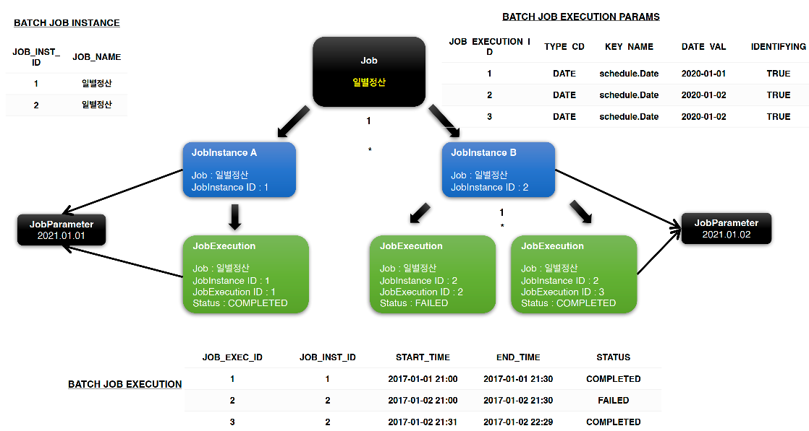

---

## Step

1. 기본 개념
   * Batch job을 구성하는 독립적인 하나의 단계로서 실제 배치 처리를 정의하고 컨트롤하는 데 필요한 모든 정보를 가지고 있는 도메인 객체
   * 단순한 단일 태스크 뿐 아니라 입력과 처리 그리고 출력과 관련된 복잡한 비즈니스 로직을 포함하는 모든 설정들을 담고 있다.
   * 배치작업을 어떻게 구성하고 실행할 것인지 Job 의 세부 작업을 Task 기반으로 설정하고 명세해 놓은 객체
   * 모든 Job은 하나 이상의 step으로 구성됨


2. 기본 구현체
   * TaskletStep
     * 가장 기본이 되는 클래스로서 Tasklet 타입의 구현체들을 제어한다
   * PartitionStep
     * 멀티 스레드 방식으로 Step 을 여러 개로 분리해서 실행한다
   * JobStep
     * Step 내에서 Job 을 실행하도록 한다
   * FlowStep
     * Step 내에서 Flow 를 실행하도록 한다


* Step class 구조
  * 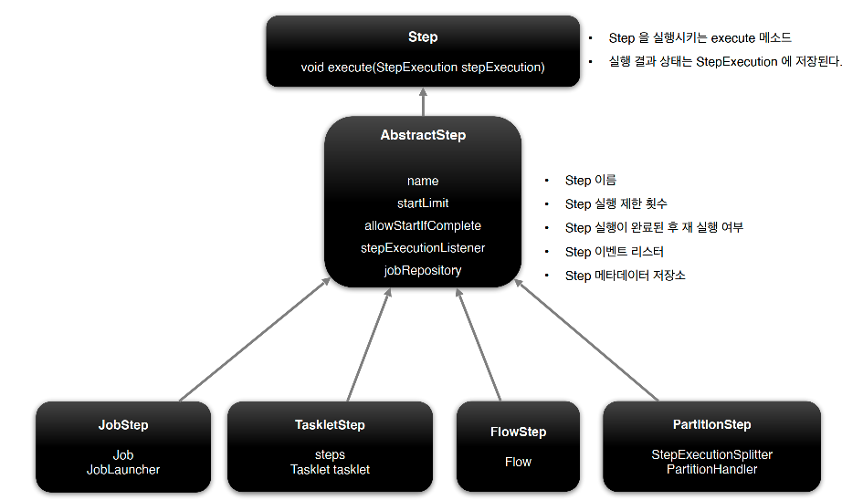 
  * 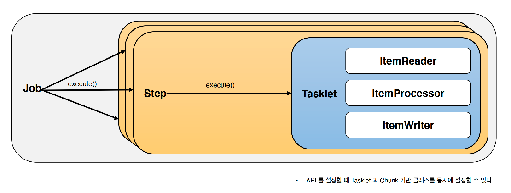

* ### API 설정에 따른 각 Step 생성
  * 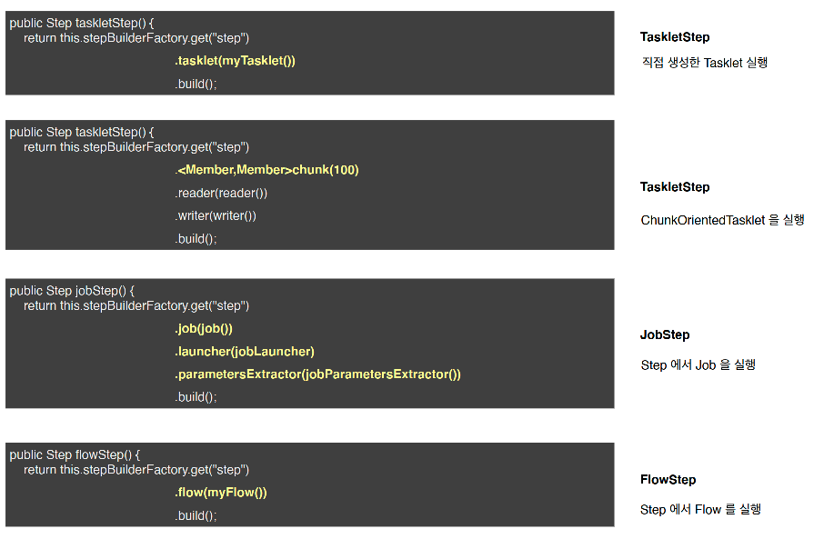

## StepExecution

1. 기본 개념
   * Step 에 대한 한번의 시도를 의미하는 객체로서 Step 실행 중에 발생한 정보들을 저장하고 있는 객체
     * 시작시간, 종료시간 ,상태(시작됨,완료,실패), commit count, rollback count 등의 속성을 가짐
   * Step 이 매번 시도될 때마다 생성되며 각 Step 별로 생성된다
   * `Job 이 재시작 하더라도 이미 성공적으로 완료된 Step 은 재 실행되지 않고 실패한 Step 만 실행된다`
   * `이전 단계 Step이 실패해서 현재 Step을 실행하지 않았다면 StepExecution을 생성하지 않는다. Step이 실제로 시작됐을 때만 StepExecution을 생성한다`
   * JobExecution 과의 관계
     * Step의 StepExecution 이 모두 정상적으로 완료 되어야 JobExecution이 정상적으로 완료된다.
     * Step의 StepExecution 중 하나라도 실패하면 JobExecution 은 실패한다
2. BATCH_STEP_EXECUTION 테이블과 매핑
   * JobExecution 와 StepExecution 는 1:M 의 관계
   * 하나의 Job 에 여러 개의 Step 으로 구성했을 경우 각 StepExecution 은 하나의 JobExecution 을 부모로 가진다


* 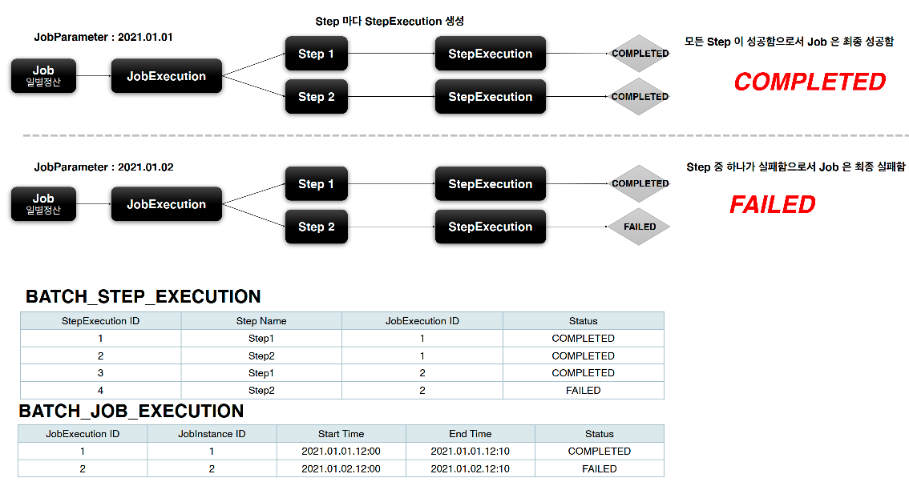

* StepExecution class
  * 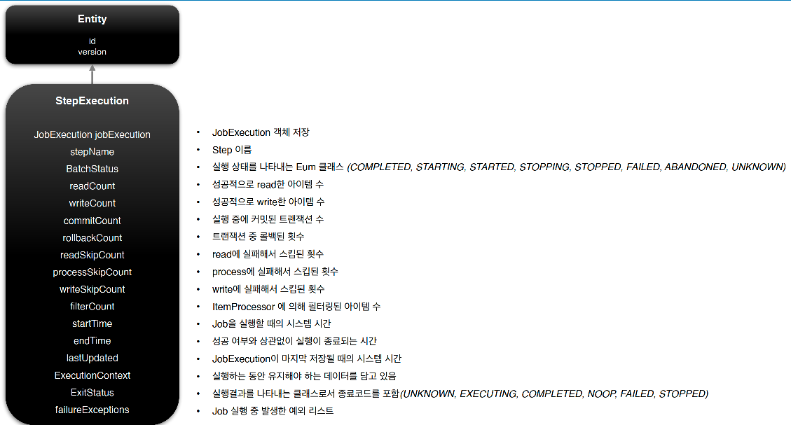 

## StepContribution

1. 기본 개념
   * 청크 프로세스의 변경 사항을 버퍼링 한 후 StepExecution 상태를 업데이트하는 도메인 객체
   * 청크 커밋 직전에 StepExecution 의 apply 메서드를 호출하여 상태를 업데이트 함
   * ExitStatus 의 기본 종료코드 외 사용자 정의 종료코드를 생성해서 적용 할 수 있음

2. 구조
   * 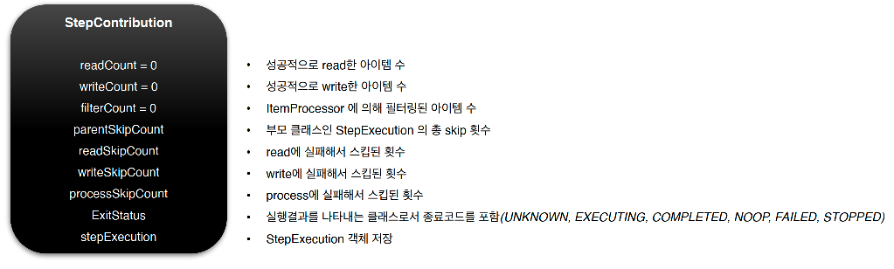
   
* StepContribution 흐름
  *  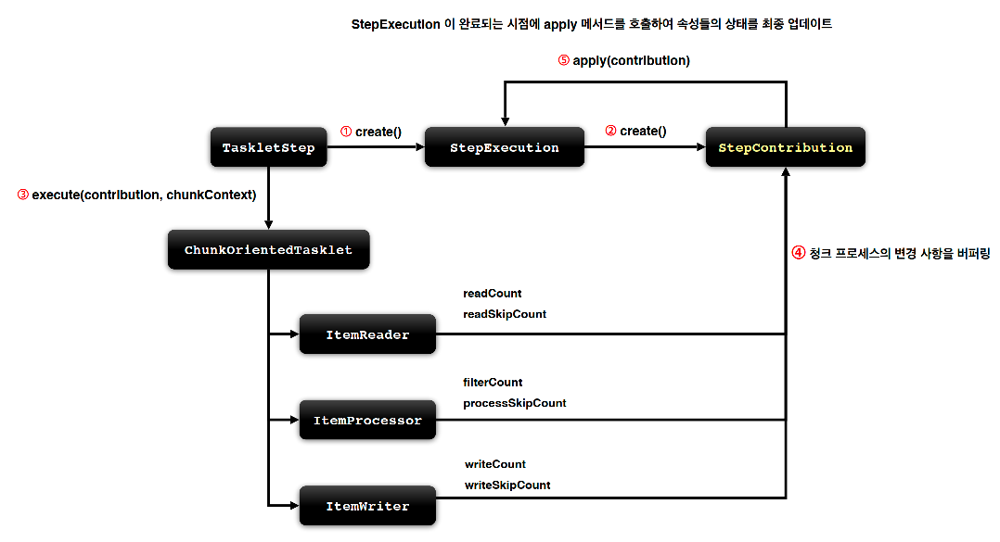

## ExecutionContext

1. 기본 개념
   * 프레임워크에서 유지 및 관리하는 키/값으로 된 컬렉션으로 StepExecution 또는 JobExecution 객체의 상태(state)를 저장하는 공유 객체
   * DB 에 직렬화 한 값으로 저장됨 - { “key” : “value”}
   * 공유 범위
     * Step 범위 – 각 Step 의 StepExecution 에 저장되며 Step 간 서로 공유 안됨
     * Job 범위 – 각 Job의 JobExecution 에 저장되며 Job 간 서로 공유 안되며 해당 Job의 Step 간 서로 공유됨
   * Job 재 시작시 이미 처리한 Row 데이터는 건너뛰고 이후로 수행하도록 할 때 상태 정보를 활용한다

2. 구조

* 

* 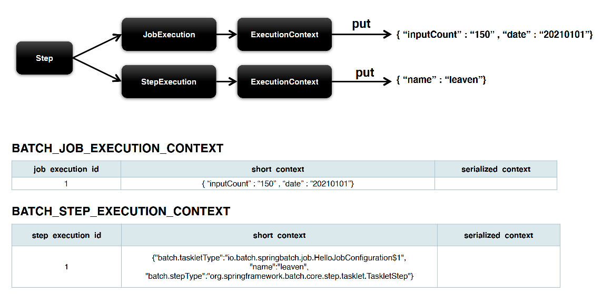

* 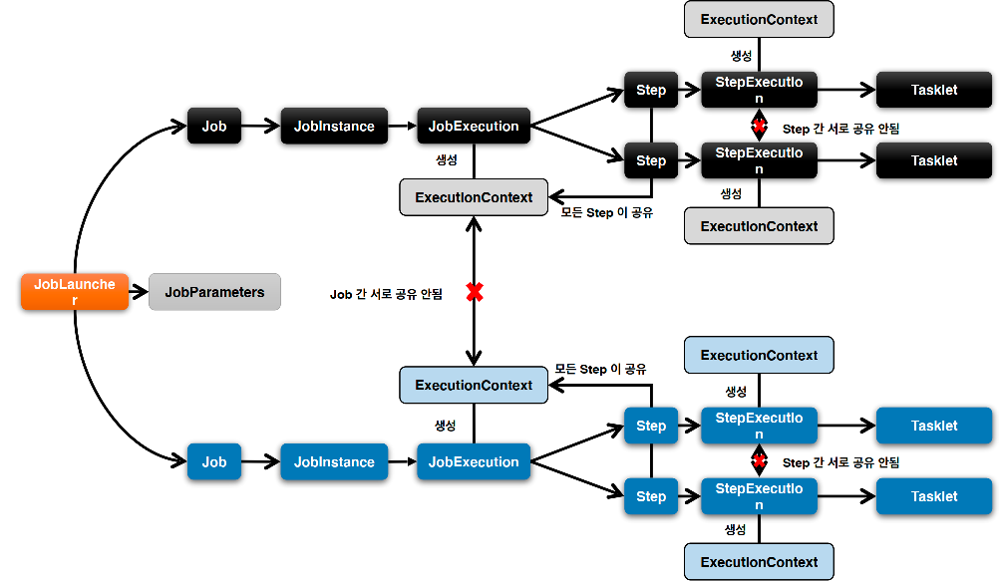


## JobRepository

1. 기본 개념
   * 배치 작업 중의 정보를 저장하는 저장소 역할
   * Job이 언제 수행되었고, 언제 끝났으며, 몇 번이 실행되었고 실행에 대한 결과 등의 배치 작업의 수행과 관련된 모든 meta data 를 저장함
     * JobLauncher, Job, Step 구현체 내부에서 CRUD 기능을 처리함
   
   * 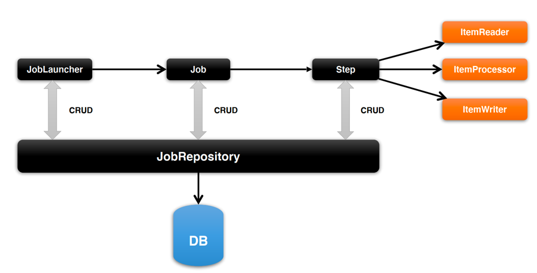

* JobRepository class
  * 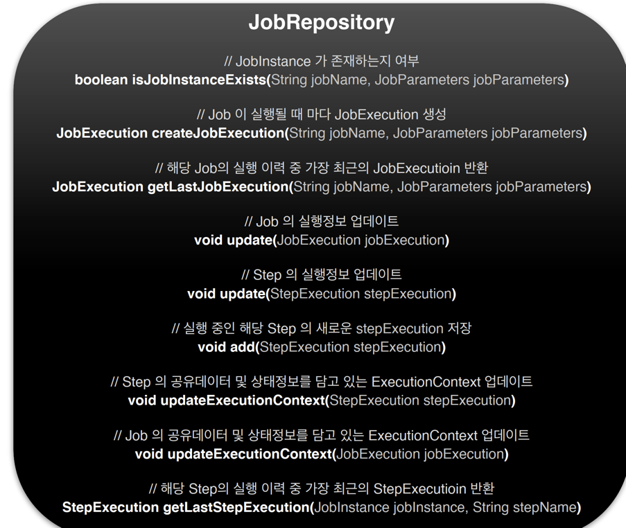 

* JobRepository 설정
  * @EnableBatchProcessing 어노테이션만 선언하면 JobRepository 가 자동으로 빈으로 생성됨
  * BatchConfigurer 인터페이스를 구현하거나 BasicBatchConfigurer 를 상속해서 JobRepository 설정을 커스터마이징 할 수 있다
    * JDBC 방식으로 설정- JobRepositoryFactoryBean
      * 내부적으로 AOP 기술를 통해 트랜잭션 처리를 해주고 있음
      * 트랜잭션 isolation 의 기본값은 SERIALIZEBLE 로 최고 수준, 다른 레벨(READ_COMMITED, REPEATABLE_READ)로 지정 가능
      * 메타테이블의 Table Prefix 를 변경할 수 있음, 기본 값은 “BATCH_” 임

* In Memory 방식으로 설정 – MapJobRepositoryFactoryBean
  * 성능 등의 이유로 도메인 오브젝트를 굳이 데이터베이스에 저장하고 싶지 않을 경우
  * 보통 Test 나 프로토타입의 빠른 개발이 필요할 때 사용

1. JDBC 방식
```java
@Override
protected JobRepository createJobRepository() throws Exception {
        JobRepositoryFactoryBean factory = new JobRepositoryFactoryBean();
        factory.setDataSource(dataSource);
        factory.setTransactionManager(transactionManager);
        factory.setIsolationLevelForCreate("ISOLATION_SERIALIZABLE"); // isolation 수준, 기본값은 “ISOLATION_SERIALIZABLE”
        factory.setTablePrefix(“SYSTEM_"); // 테이블 Prefix, 기본값은 “BATCH_”, BATCH_JOB_EXECUTION 가 SYSTEM_JOB_EXECUTION 으로 변경됨
        factory.setMaxVarCharLength(1000); // varchar 최대 길이(기본값 2500)
        return factory.getObject(); // Proxy 객체가 생성됨 (트랜잭션 Advice 적용 등을 위해 AOP 기술 적용)
}
```

2. In Memory 방식
```java
@Override
protected JobRepository createJobRepository() throws Exception {
    MapJobRepositoryFactoryBean factory = new MapJobRepositoryFactoryBean();
    factory.setTransactionManager(transactionManager); // ResourcelessTransactionManager 사용
    return factory.getObject();
}
```

---

## JobLauncher

1. 기본 개념
   * 배치 Job 을 실행시키는 역할을 한다
   * Job과 Job Parameters를 인자로 받으며 요청된 배치 작업을 수행한 후 최종 client 에게 JobExecution을 반환함
   * 스프링 부트 배치가 구동이 되면 JobLauncher 빈이 자동 생성 된다
   * Job 실행
     * `JobLanucher.run(Job, JobParameters)`
     * 스프링 부트 배치에서는 JobLauncherApplicationRunner 가 자동적으로 JobLauncher 을 실행시킨다
     * 동기적 실행
       * taskExecutor 를 SyncTaskExecutor 로 설정할 경우 (기본값은 SyncTaskExecutor)
       * JobExecution 을 획득하고 배치 처리를 최종 완료한 이후 Client 에게 JobExecution 을 반환
       * 스케줄러에 의한 배치처리에 적합 함 – 배치처리시간이 길어도 상관없는 경우
     
     * 비 동기적 실행
       * taskExecutor 가 SimpleAsyncTaskExecutor 로 설정할 경우
       * JobExecution 을 획득한 후 Client 에게 바로 JobExecution 을 반환하고 배치처리를 완료한다
       * HTTP 요청에 의한 배치처리에 적합함 – 배치처리 시간이 길 경우 응답이 늦어지지 않도록 함

* 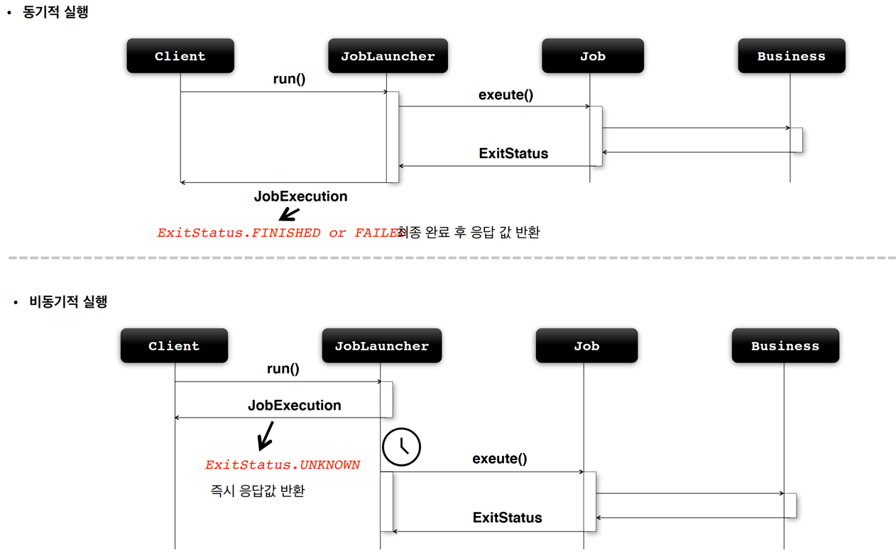

# 4. 스프링 배치 실행

## 배치 초기화 설정 (properties, yml)
1. JobLauncherApplicationRunner
   * Spring Batch 작업을 시작하는 ApplicationRunner 로서 BatchAutoConfiguration 에서 생성됨
   * 스프링 부트에서 제공하는 ApplicationRunner 의 구현체로 어플리케이션이 정상적으로 구동되자 마다 실행됨
   * 기본적으로 빈으로 등록된 모든 job 을 실행시킨다.
2. BatchProperties
   * Spring Batch 의 환경 설정 클래스
   * Job 이름, 스키마 초기화 설정, 테이블 Prefix 등의 값을 설정할 수 있다.
   * application.properties or application.yml 파일에 설정함
     * ```yml
       batch:
         job:
         names: ${job.name:NONE}
         initialize-schema: NEVER
         tablePrefix: SYSTEM
       ```
     
3. Job 실행 옵션
   * 지정한 Batch Job만 실행하도록 할 수 있음
   * spring.batch.job.names: ${job.name:NONE}
   * 어플리케이션 실행시 Program arguments 로 job 이름 입력한다
     * --job.name=helloJob
     * --job.name=helloJob,simpleJob (하나 이상의 job 을 실행 할 경우 쉼표로 구분해서 입력함)

---

## JobBuilderFactory / JobBuilder

1. 스프링 배치는 Job 과 Step 을 쉽게 생성 및 설정할 수 있도록 util 성격의 빌더 클래스들을 제공함

2. JobBuilderFactory
   * JobBuilder 를 생성하는 팩토리 클래스로서 get(String name) 메서드 제공
   * jobBuilderFactory.get(“jobName")
     * “jobName” 은 스프링 배치가 Job 을 실행시킬 때 참조하는 Job 의 이름

3. JobBuilder
   * Job 을 구성하는 설정 조건에 따라 두 개의 하위 빌더 클래스를 생성하고 실제 Job 생성을 위임한다
   * SimpleJobBuilder
     * SimpleJob 을 생성하는 Builder 클래스
     * Job 실행과 관련된 여러 설정 API 를 제공한다
   * FlowJobBuilder
     * FlowJob 을 생성하는 Builder 클래스
     * 내부적으로 FlowBuilder 를 반환함으로써 Flow 실행과 관련된 여러 설정 API 를 제공한다

### `아키텍처`

* 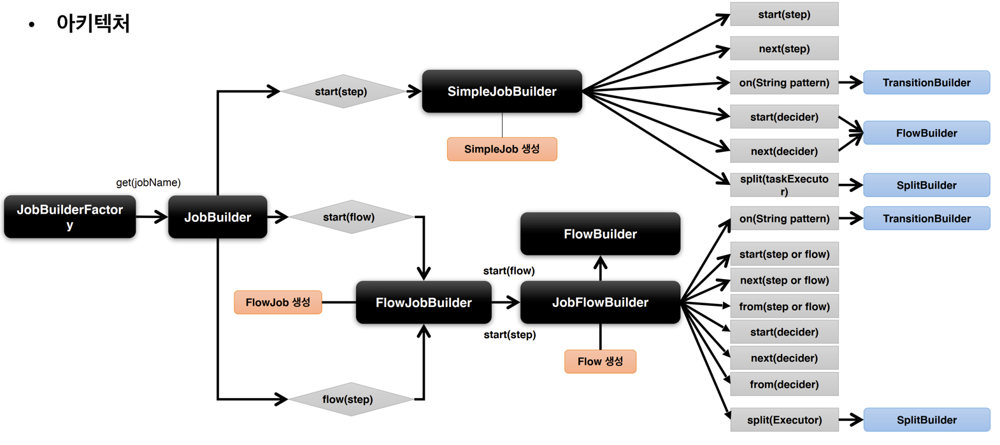

### `클래스 상속 구조`
* 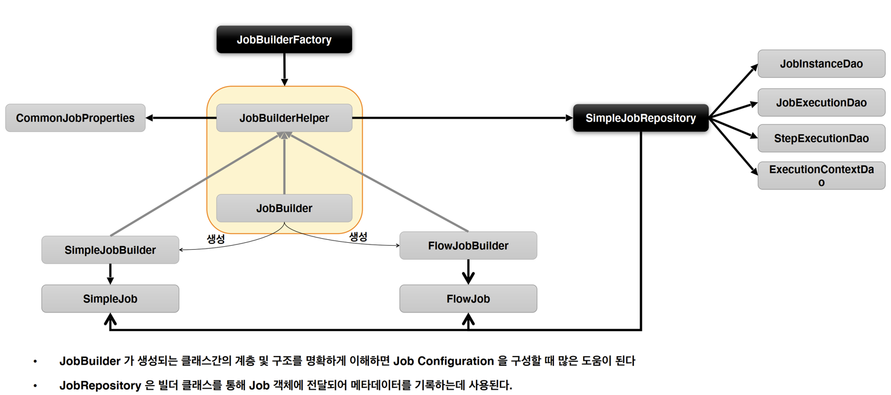

## 개념 및 API 소개

1. 기본개념
   * SimpleJob 은 Step 을 실행시키는 Job 구현체로서 SimpleJobBuilder 에 의해 생성된다
   * 여러 단계의 Step 으로 구성할 수 있으며 Step 을 순차적으로 실행시킨다
   * 모든 Step 의 실행이 성공적으로 완료되어야 Job 이 성공적으로 완료 된다
   * 맨 마지막에 실행한 Step 의 BatchStatus 가 Job 의 최종 BatchStatus 가 된다

2. 흐름
* 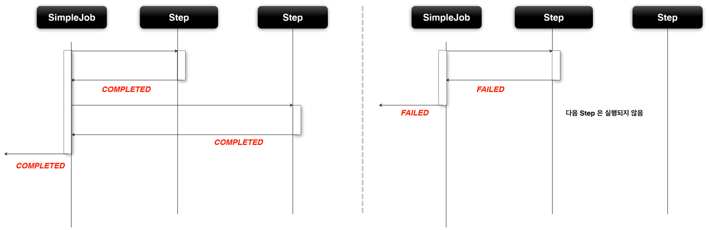


## API 설정 - start() / next()  메서드

* .start(Step) // 처음 실행할 STep 설정. 최초 한번 설정. SimpleJobBuilder가 생성되고 반환 
* .next(Step) // 다음에 실행할 Step들을 순차적으로 연결하도록 설정 . 모든 Step이 종료되면 Job 종료 
* 

## validator() 메서드 
1. 기본개념
   * Job 실행에 꼭 필요한 파라미터를 검증하는 용도
   * DefaultJobParametersValidator 구현체를 지원하며, 좀 더 복잡한 제약 조건이 있다면 인터페이스를 직접 구현할 수도 있음

## preventRestart()

1. 기본개념
   * Job 의 재 시작 여부를 설정
   * 기본 값은 true 이며 false 로 설정 시 “ 이 Job은 재 시작을 지원하지 않는다 ” 라는 의미
   * Job 이 실패해도 재 시작이 안되며 Job을 재 시작하려고 하면 JobRestartException이 발생
   * 재 시작과 관련 있는 기능으로 Job 을 처음 실행하는 것 과는 아무런 상관 없음

2. 흐름도
    * 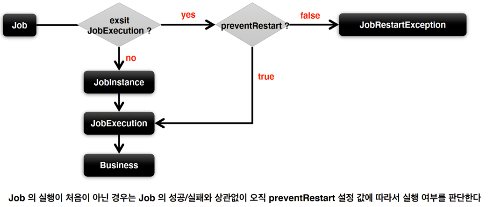

## incrementer()
1. 기본개념
   * JobParameters 에서 필요한 값을 증가시켜 다음에 사용될 JobParameters 오브젝트를 리턴
   * 기존의 JobParameter 변경없이 Job 을 여러 번 시작하고자 할때
   * RunIdIncrementer 구현체를 지원하며 인터페이스를 직접 구현할 수 있음
   * 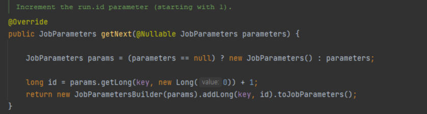

---

## StepBuilderFactory / StepBuilder

1. StepBuilderFactory
   * StepBuilder 를 생성하는 팩토리 클래스로서 get(String name) 메서드 제공
   * StepBuilderFactory.get(“stepName")
     * “stepName” 으로 Step 을 생성

2. StepBuilder
   * Step 을 구성하는 설정 조건에 따라 다섯 개의 하위 빌더 클래스를 생성하고 실제 Step 생성을 위임한다
   * TaskletStepBuilder
     * TaskletStep 을 생성하는 기본 빌더 클래스
   * SimpleStepBuilder
     * TaskletStep 을 생성하며 내부적으로 청크기반의 작업을 처리하는 ChunkOrientedTasklet 클래스를 생성한다
   * PartitionStepBuilder
     * PartitionStep 을 생성하며 멀티 스레드 방식으로 Job 을 실행한다
   * JobStepBuilder
     * JobStep 을 생성하여 Step 안에서 Job 을 실행한다
   * FlowStepBuilder
     * FlowStep 을 생성하여 Step 안에서 Flow 를 실행한다

---

## TaskletStep

1. 기본 개념
   * 스프링 배치에서 제공하는 Step 의 구현체로서 Tasklet 을 실행시키는 도메인 객체
   * RepeatTemplate 를 사용해서 Tasklet 의 구문을 트랜잭션 경계 내에서 반복해서 실행함
   * Task 기반과 Chunk 기반으로 나누어서 Tasklet 을 실행함

2. Task vs Chunk 기반 비교
   * 스프링 배치에서 Step의 실행 단위는 크게 2가지로 나누어짐
     * chunk 기반
       * 하나의 큰 덩어리를 n개씩 나눠서 실행한다는 의미로 대량 처리를 하는 경우 효과적으로 설계 됨
       * ItemReader, ItemProcessor, ItemWriter 를 사용하며 청크 기반 전용 Tasklet 인 ChunkOrientedTasklet 구현체가 제공된다
   * Task 기반
     * ItemReader 와 ItemWriter 와 같은 청크 기반의 작업 보다 단일 작업 기반으로 처리되는 것이 더 효율적인 경우
     * 주로 Tasklet 구현체를 만들어 사용
     * 대량 처리를 하는 경우 chunk 기반에 비해 더 복잡한 구현 필요

* 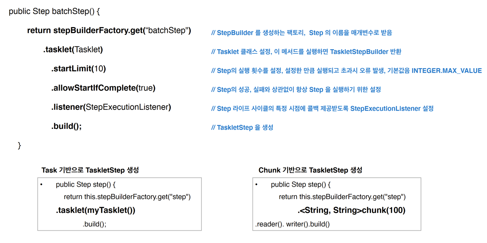

## tasklet() 메서드 

1. 기본 개념
   * Tasklet 타입의 클래스를 설정한다
     * Tasklet
       * Step 내에서 구성되고 실행되는 도메인 객체로서 주로 단일 태스크를 수행하기위한 것
       * TaskletStep 에 의해 반복적으로 수행되며 반환값에 따라 계속 수행 혹은 종료한다
       * RepeatStatus - Tasklet 의 반복 여부 상태 값
         * RepeatStatus.FINISHED - Tasklet 종료, RepeatStatus 을 null 로 반환하면 RepeatStatus.FINISHED로 해석됨
         * RepeatStatus.CONTINUABLE - Tasklet 반복
         * RepeatStatus.FINISHED가 리턴되거나 실패 예외가 던져지기 전까지 TaskletStep 에 의해 while 문 안에서 반복적으로 호출됨 (무한루프 주의)
   * 익명 클래스 혹은 구현 클래스를 만들어서 사용한다
   * 이 메소드를 실행하게 되면 TaskletStepBuilder 가 반환되어 관련 API 를 설정할 수 있다.
   * Step 에 오직 하나의 Tasklet 설정이 가능하며 두개 이상을 설정 했을 경우 마지막에 설정한 객체가 실행된다

## startLimit() / allowStartIfComplete()

### startLimit()
1. 기본 개념
   * Step의 실행 횟수를 조정할 수 있다
   * Step 마다 설정할 수 있다
   * 설정 값을 초과해서 다시 실행하려고 하면 StartLimitExceededException이 발생
   * start-limit의 디폴트 값은 Integer.MAX_VALUE

### allowStartIfComplete()
1. 기본 개념
   * 재시작 가능한 job 에서 Step 의 이전 성공 여부와 상관없이 항상 step 을 실행하기 위한 설정
   * `실행 마다 유효성을 검증하는 Step이나 사전 작업이 꼭 필요한 Step 등`
   * 기본적으로 COMPLETED 상태를 가진 Step 은 Job 재 시작 시 실행하지 않고 스킵한다
   * allow-start-if-complete가 “true”로 설정된 step은 항상 실행한다

2. 흐름도
    * 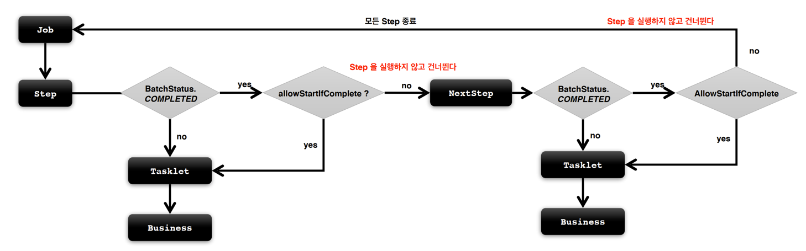

---

## JobStep
1. 기본 개념
   * Job 에 속하는 Step 중 외부의 Job 을 포함하고 있는 Step
   * 외부의 Job 이 실패하면 해당 Step 이 실패하므로 결국 최종 기본 Job 도 실패한다
   * 모든 메타데이터는 기본 Job 과 외부 Job 별로 각각 저장된다.
   * 커다란 시스템을 작은 모듈로 쪼개고 job의 흐름를 관리하고자 할 때 사용할 수 있다


2. API 소개
    * 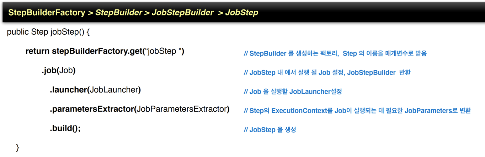


## FlowJob

1. 기본개념
   * Step 을 순차적으로만 구성하는 것이 아닌 특정한 상태에 따라 흐름을 전환하도록 구성할 수 있으며 FlowJobBuilder 에 의해 생성된다
     * Step 이 실패 하더라도 Job 은 실패로 끝나지 않도록 해야 하는 경우
     * Step 이 성공 했을 때 다음에 실행해야 할 Step 을 구분해서 실행 해야 하는경우
     * 특정 Step은 전혀 실행되지 않게 구성 해야 하는 경우
   * Flow 와 Job 의 흐름을 구성하는데만 관여하고 실제 비즈니스 로직은 Step 에서 이루어진다
   * 내부적으로 SimpleFlow 객체를 포함하고 있으며 Job 실행 시 호출한다

2. SimpleJob vs FlowJob
  * 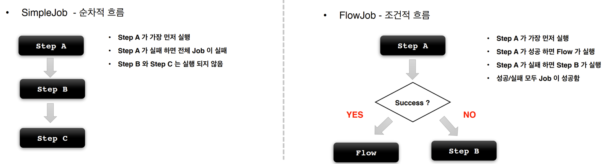

  * 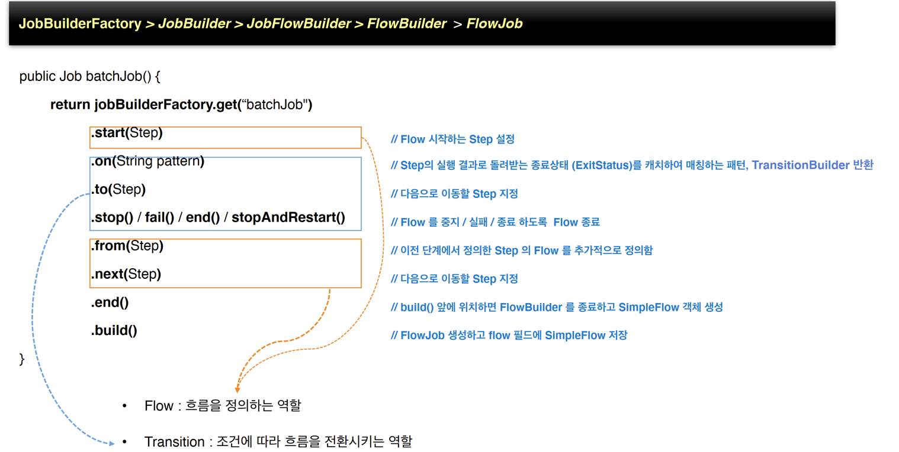

## 배치 상태 유형 - BatchStatus / ExitStatus / FlowExecutionStatus

* ### BatchStatus
  * JobExecution 과 StepExecution의 속성으로 Job 과 Step 의 종료 후 최종 결과 상태가 무엇인지 정의
  * SimpleJob
    * 마지막 Step 의 BatchStatus 값을 Job 의 최종 BatchStatus 값으로 반영
    * Step 이 실패할 경우 해당 Step 이 마지막 Step 이 된다
  * FlowJob
    * Flow 내 Step 의 ExitStatus 값을 FlowExecutionStatus 값으로 저장
    * 마지막 Flow 의 FlowExecutionStatus 값을 Job 의 최종 BatchStatus 값으로 반영

* COMPLETED, STARTING, STARTED, STOPPING, STOPPED, FAILED, ABANDONED, UNKNOWN
* ABANDONED 는 처리를 완료했지만 성공하지 못한 단계와 재시작시 건너 뛰어야하는 단계

* ### ExitStatus
  * JobExecution 과 StepExecution의 속성으로 Job 과 Step 의 실행 후 어떤 상태로 종료되었는지 정의
  * 기본적으로 ExitStatus 는 BatchStatus 와 동일한 값으로 설정된다
  * SimpleJob
    * 마지막 Step 의 ExitStatus 값을 Job 의 최종 ExitStatus 값으로 반영
  * FlowJob
    * Flow 내 Step 의 ExitStatus 값을 FlowExecutionStatus 값으로 저장
    * 마지막 Flow 의 FlowExecutionStatus 값을 Job 의 최종 ExitStatus 값으로 반영
  * UNKNOWN, EXECUTING, COMPLETED, NOOP, FAILED, STOPPED
  * exitCode 속성으로 참조


# 5. 스프링 배치 청크 프로세스 (1)

# 6. 스프링 배치 청크 프로세스 (2)

# 7. 스프링 배치 반복 및 오류 제어

# 8. 스프링 배치 멀티 스레드 프로세싱

# 9. 스프링 배치 이벤트 리스너

# 10. 스프링 배치 테스트 및 운영

# 11. 실전 ! 스프링 배치

